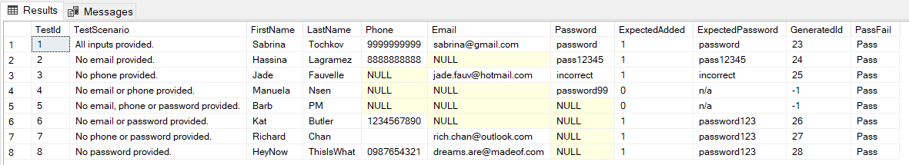
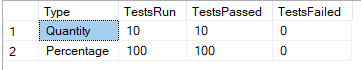
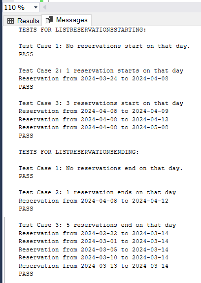
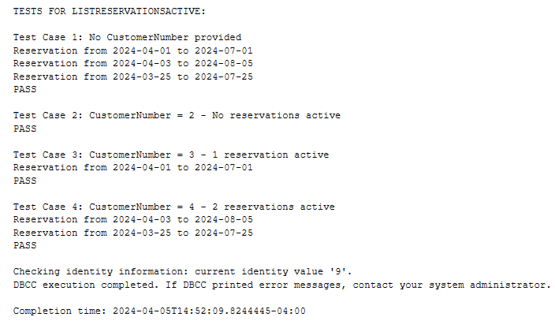
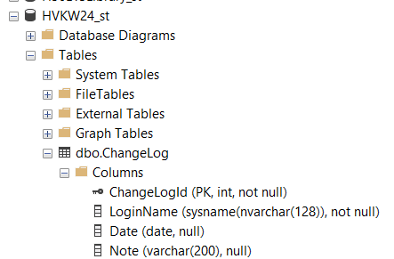
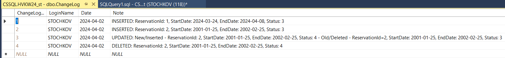
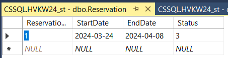

# A3 - Answers


## **Part A - Test cases and implementation**  
This question modifies a stored procedure you created in Assignment 2 and includes password field handling.  The purpose of Part A is to get familiar with writing test cases and automated the testing.  Make sure you keep track of how long it took you to complete Part A to help you estimate the work for subsequent parts of the assignment.  Note that Parts B & C will require more work/time than Part A.  

### Q1 Write a T-SQL stored procedure called `AddNewCustomer` that adds a new customer to the HVK database. The procedure should take as inputs the new customer’s: ** use transactions **
- first name  
- last name  
- phone number  
- e-mail address  
- password  
### and provide as output:
- the customer id assigned to this customer
- an indication if the customer was added (use BIT type for this where 1 is true, and 0 is false)  
### By default, the phone number and e-mail should be set to `NULL` if none is provided.  If no password is provided, by default the password should be set to `password123`.  All new customers must provide either a phone number or an email, so if neither is provided, your procedure should not create the new customer, and should return `-1` as the customer id, and `false` for the added field.  Ensure that you create a **test plan** to cover all the necessary conditions. Create automated test code to test your cases.  Use a `table variable` to store your test inputs and expected results and use it in your automated test code.  Ensure that your test code determines the pass / fail status.  
  
### a) Create your test case plan in the following table.  Add rows and columns as needed.  **Be sure to include enough test cases to exercise all conditions in your stored procedure**.  When you have completed your testing, make sure you update the pass/ fail column of the table.  Also ensure that your test results clearly show the expected results and actual results, in addition to the pass / fail status.  
  
| Test<br>Case | Input Data                                                                                                    | Expected Result                                                      | Pass/Fail |
| --------- | ------------------------------------------------------------------------------------------------------------- | -------------------------------------------------------------------- | --------- |
| 1         | Sabrina<br>Tochkov<br>9999999999<br>[sabrina@gmail.com](mailto:sabrina@gmail.com)<br>password                 | Customer added<br>Output: ID assigned & 1                            | Pass      |
| 2         | Hassina<br>Lagramez<br>8888888888<br>\* no email<br>pass12345                                                 | Customer added<br>Output: ID assigned & 1                            | Pass      |
| 3         | Jade<br>Fauvelle<br>\* no phone<br>[jade.fauv@hotmail.com](mailto:jade.fauv@hotmail.com)<br>incorrect         | Customer added<br>Output: ID assigned & 1                            | Pass      |
| 4         | Manuela<br>Nsen<br>\* no email or phone<br>password99                                                         | Customer not added<br>Output: -1 for ID & 0                          | Pass      |
| 5         | Barb<br>PM<br>\* no email, phone<br>or password                                                               | Customer not added<br>Output: 01 for ID & 0                          | Pass      |
| 6         | Kat<br>Butler<br>1234567890<br>\* no email or password                                                        | Customer added<br>Output: ID assigned & 1<br>(default "password123") | Pass      |
| 7         | Richard<br>Chan<br>[rich.chan@outlook.com](mailto:rich.chan@outlook.com)<br>\* no phone or password           | Customer added<br>Output: ID assigned & 1<br>(default "password123") | Pass      |
| 8         | HeyNow<br>ThisIsWhat<br>0987654321<br>[dreams.are@madeof.com](mailto:dreams.are@madeof.com)<br>\* no password | Customer added<br>Output: ID assigned & 1<br>(default "password123") | Pass      |

### b) Stored Proc  
```SQL
/*
The following code creates a stored procedure called AddNewCustomer
that adds a new HVKUser to the HVK database. It takes in as inputs: 
first name, last name, phone number, email and password. It outputs:
the customer ID assigned to the customer (or -1 if not created) and 
a bit indicating if the customer was added or not (1 or 0).
Either email or password is required (can add both, but not neither).
If no password is provided, a default value of "password123" is applied.
*/

Use HVKW24_st;
GO
CREATE OR ALTER PROCEDURE AddNewCustomer (
	@FirstName VARCHAR(25), 
	@LastName VARCHAR(25),
	@Phone CHAR(10) = NULL,
	@Email VARCHAR(50) = NULL,
	@Password VARCHAR(50) = 'password123',
	@CustomerId INT OUTPUT,
	@WasAdded BIT OUTPUT)
AS
BEGIN
	IF (@Phone IS NULL AND @Email IS NULL)
		BEGIN
			SET @CustomerId = -1;
			SET @WasAdded = 0;
			RETURN;
		END;
	ELSE
		BEGIN
			INSERT INTO HVKUser (FirstName, LastName, Phone, Email, Password)
			VALUES (@FirstName, @LastName, @Phone, @Email, @Password);
			SET @CustomerId = SCOPE_IDENTITY();
			SET @WasAdded = 1;
			RETURN;
		END;
END;
GO
```  
### c) Automated test cases  
```SQL
/*
The following code tests the AddNewCustomer stored procedure
by using a Table variable with the test data define in a). It uses a transaction,
so all inserts will be rolled back and changes to the database will not be permanent.
The table variable is displayed with a SELECT to show if the test cases passed or failed.
*/
Use HVKW24_st;

DECLARE @TestAddNewCustomer TABLE (
	TestId INT,
	TestScenario VARCHAR(50),
	FirstName VARCHAR(25),
	LastName VARCHAR(25),
	Phone CHAR(10),
	Email VARCHAR(50),
	Password VARCHAR(50),
	ExpectedAdded BIT,
	ExpectedPassword VARCHAR(50),
	GeneratedId INT,
	PassFail VARCHAR(10)
	);

INSERT INTO @TestAddNewCustomer VALUES
(1, 'All inputs provided.', 'Sabrina', 'Tochkov', '9999999999', 'sabrina@gmail.com', 'password', 1, 'password', 0, 'Fail'),
(2, 'No email provided.', 'Hassina', 'Lagramez', '8888888888', NULL, 'pass12345', 1, 'pass12345', 0, 'Fail'),
(3, 'No phone provided.', 'Jade', 'Fauvelle', NULL, 'jade.fauv@hotmail.com', 'incorrect', 1, 'incorrect', 0, 'Fail'),
(4, 'No email or phone provided.', 'Manuela', 'Nsen', NULL, NULL, 'password99', 0, 'n/a', 0,  'Fail'),
(5, 'No email, phone or password provided.', 'Barb', 'PM', NULL, NULL, NULL, 0, 'n/a', 0, 'Fail'),
(6, 'No email or password provided.', 'Kat', 'Butler', '1234567890', NULL, NULL, 1, 'password123', 0, 'Fail'),
(7, 'No phone or password provided.', 'Richard', 'Chan', '', 'rich.chan@outlook.com', NULL, 1, 'password123', 0, 'Fail'),
(8, 'No password provided.', 'HeyNow', 'ThisIsWhat', '0987654321', 'dreams.are@madeof.com', NULL, 1, 'password123', 0, 'Fail');

DECLARE
	@Count INT,
	@First VARCHAR(25),
	@Last VARCHAR(25),
	@PhoneNum CHAR(10),
	@Mail VARCHAR(50),
	@Pass VARCHAR(50),
	@Id INT,
	@Added BIT;

SET @Count = 1;

BEGIN TRANSACTION;

WHILE (@Count <=8)
	BEGIN
		SET @First = (SELECT FirstName FROM @TestAddNewCustomer WHERE TestId = @Count);
		SET @Last = (SELECT LastName FROM @TestAddNewCustomer WHERE TestId = @Count);
		SET @PhoneNum = (SELECT Phone FROM @TestAddNewCustomer WHERE TestId = @Count);
		SET @Mail = (SELECT Email FROM @TestAddNewCustomer WHERE TestId = @Count);
		SET @Pass = (SELECT Password FROM @TestAddNewCustomer WHERE TestId = @Count);

		IF (@Pass IS NULL)
			EXECUTE AddNewCustomer 
				@FirstName = @First,
				@LastName = @Last,
				@Phone = @PhoneNum,
				@Email = @Mail,
				@CustomerId = @Id OUTPUT,
				@WasAdded = @Added OUTPUT;
		ELSE IF (@Pass IS NOT NULL)
			EXECUTE AddNewCustomer 
				@FirstName = @First,
				@LastName = @Last,
				@Phone = @PhoneNum,
				@Email = @Mail,
				@Password = @Pass,
				@CustomerId = @Id OUTPUT,
				@WasAdded = @Added OUTPUT;

		IF (@Added = (SELECT ExpectedAdded FROM @TestAddNewCustomer WHERE TestId = @Count))
			BEGIN
				IF (@Added = 1)
					BEGIN
						SET @Pass = (SELECT Password FROM HVKUser WHERE HVKUserId = @Id);
						IF (@Pass = (SELECT ExpectedPassword FROM @TestAddNewCustomer WHERE TestId = @Count))
							BEGIN
								UPDATE @TestAddNewCustomer SET GeneratedId = @Id WHERE TestId = @Count;
								UPDATE @TestAddNewCustomer SET PassFail = 'Pass' WHERE TestId = @Count;
							END;
					END;
				ELSE
					BEGIN
						UPDATE @TestAddNewCustomer SET GeneratedId = @Id WHERE TestId = @Count;
						UPDATE @TestAddNewCustomer SET PassFail = 'Pass' WHERE TestId = @Count;
					END;
			END;

		SET @Count = @Count + 1;
	END;

ROLLBACK;

SELECT * FROM @TestAddNewCustomer;

DBCC CHECKIDENT ('[HVKUser]', RESEED, 22);
GO
```  
### d) Outputs    



---
## **Part B - Test cases and implementation for Stored Procedures**  
Note that the HVK database script provided with this assignment has all reservation data removed.  This is intentional.  You must create scripts to add the data you need for testing.  Data for other tables such as members, pets, etc. is still there, and you can build reservations based on those customers and pets.  

### Q1 Create the following stored procedures for the HVK DB provided with this assignment:
### a) `ListReservationsStarting` which returns a cursor through an output parameter. The cursor should list all reservation ids, start date and end date as output for a specified input start date, sorted by reservation id.  
```SQL
/*
The following defines a stored procedure called ListReservationsStarting
which takes a start date as an input and returns a 
cursor that lists all the resevations that start on that day.
*/

Use HVKW24_st;
GO
CREATE OR ALTER PROCEDURE ListReservationsStarting
(@StartDate DATE, @StartingCursor CURSOR VARYING OUTPUT)
AS
BEGIN
	SET @StartingCursor = CURSOR
	FOR SELECT ReservationId, StartDate, EndDate
	FROM dbo.Reservation WHERE StartDate = @StartDate
	ORDER BY ReservationId;
	OPEN @StartingCursor;
	RETURN
END;
GO
```  
### b) `ListReservationsEnding` which returns a cursor through an output parameter. The cursor should list all reservation ids, start date and end date as output for a specified input end date, sorted by reservation id.  
```SQL
/*
The following defines a stored procedure called ListReservationsEnding
which takes a end date as an input and returns a 
cursor that lists all the resevations that end on that day.
*/

Use HVKW24_st;
GO
CREATE OR ALTER PROCEDURE ListReservationsEnding
(@EndDate DATE, @EndingCursor CURSOR VARYING OUTPUT)
AS
BEGIN
	SET @EndingCursor = CURSOR
	FOR SELECT ReservationId, StartDate, EndDate
	FROM dbo.Reservation WHERE EndDate = @EndDate
	ORDER BY ReservationId;
	OPEN @EndingCursor;
	RETURN
END;
GO
```  
### c) `ListReservationsActive` which has an optional customer number input parameter and returns a cursor through an output parameter. The cursor should list all active reservations if the customer number is not specified and the active reservations for only that customer if it is specified. The cursor should list: the reservation number, the customer name, the pet number and name, and the start and end date of the reservation.  Assume that a reservation is active based on “today’s” date.  
```SQL
/*
The following defines a stored procedure called ListReservationsActive 
which has an optional customer number input parameter and 
returns a cursor that lists all active reservations (today) 
if the customer number is not specified or active reservations for only that customer. 
*/

Use HVKW24_st;
GO
CREATE OR ALTER PROCEDURE ListReservationsActive
(@CustomerNumber INT = NULL, @ActiveCursor CURSOR VARYING OUTPUT)
AS
BEGIN
	DECLARE @Today DATE;
	SET @Today = CONVERT(DATE, GETDATE());

	IF (@CustomerNumber IS NOT NULL)
		SET @ActiveCursor = CURSOR
		FOR SELECT r.ReservationId, c.FirstName, c.LastName, p.PetId, p.Name, r.StartDate, r.EndDate
		FROM dbo.Reservation r
		INNER JOIN dbo.PetReservation pr ON pr.ReservationId = r.ReservationId
		INNER JOIN dbo.Pet p ON pr.PetId = p.PetId
		INNER JOIN dbo.HVKUser c ON p.HVKUserId = c.HVKUserId
		WHERE @Today BETWEEN r.StartDate AND r.EndDate
		AND c.HVKUserId = @CustomerNumber 
		ORDER BY ReservationId;
	ELSE
		SET @ActiveCursor = CURSOR
		FOR SELECT r.ReservationId, c.FirstName, c.LastName, p.PetId, p.Name, r.StartDate, r.EndDate
		FROM dbo.Reservation r
		INNER JOIN dbo.PetReservation pr ON pr.ReservationId = r.ReservationId
		INNER JOIN dbo.Pet p ON pr.PetId = p.PetId
		INNER JOIN dbo.HVKUser c ON p.HVKUserId = c.HVKUserId
		WHERE @Today BETWEEN r.StartDate AND r.EndDate
		ORDER BY ReservationId;
	
	OPEN @ActiveCursor;
	RETURN;
END;
GO
```  
  
### Q2 Create a test plan for each of the stored procedures above.  Add rows and columns as needed.  When you have completed your testing, make sure you update the pass/ fail column.  
### a) `ListReservationsStarting` Test Plan 

| Test<br>Case | Input Data<br>(StartDate) | Expected Result | Pass/Pass |
| ------------ | ----------------------- | --------------------------------------------------------------------------------------------------------------------------------------- | --------- |
| 1  |  23-03-2024   | No reservations start on that day<br>Cursor is empty<br>No reservations start on that day| Pass  |
| 2  | 24-03-2024              | 1 reservation starts on that day<br>Reservation displayed:<br>24-03-2024 to 08-04-2024 | Pass      |
| 3            | 08-04-2024              | 3 reservations start on that day<br>Reservations displayed:<br>08-04-2024 to 09-04-2024<br>08-04-2024 to 12-04-2024<br>08-04-2024 to 08-05-2024 | Pass      |

  
### b) `ListReservationsEnding` Test Plan 


| Test<br>Case | Input Data<br>(EndDate) | Expected Result                                                                                                                                                                                        | Pass/Fail |
| ------------ | ----------------------- | ------------------------------------------------------------------------------------------------------------------------------------------------------------------------------------------------------ | --------- |
| 1            | 01-04-2024              | No reservations end on that day<br>Cursor is empty<br>No reservations end on that day                                                                                                   | Pass      |
| 2            | 12-04-2024              | 1 reservation ends on that day<br>Reservation displayed:<br>08-04-2024 to 12-04-2024                                                                                                                   | Pass      |
| 3            | 14-03-2024              | 5 reservations end on that day<br>Reservations displayed:<br>22-02-2024 to 14-03-2024<br>01-03-2024 to 14-03-2024<br>05-03-2024 to 14-03-2024<br>10-03-2024 to 14-03-2024<br>13-03-2024- to 14-03-2024 | Pass      |
  
### c) `ListReservationsActive` Test Plan 

| Test<br>Case | Input Data         | Expected Result                                                                                           | Pass/Fail |
| ------------ | ------------------ | --------------------------------------------------------------------------------------------------------- | --------- |
| 1            | No CustomerNumber  | 3 reservations active<br>01-04-2024 to 01-07-2024<br>03-04-2024 to 05-08-2024<br>25-03-2024 to 25-07-2024 | Fail      |
| 2            | CustomerNumber = 2 | No reservations active                                                                                    | Fail      |
| 3            | CustomerNumber = 3 | 1 reservation active<br>Reservation displayed:<br>01-04-2024 to 01-07-2024                                | Fail      |
| 4            | CustomerNumber = 4 | 2 reservations active<br>Reservations displayed:<br>03-04-2024 to 05-08-2024<br>25-03-2024 to 25-07-2024  | Fail      |
  
### Q3 Test each of your stored procedures as described below:  
- [ ] The ListXXX procedures are just lightweight wrappers for selects.  They have no error handling.  Your caller has to handle any exceptions or failures.  
- [ ] As you’re writing automated tests, you can modify, test, and rollback inserts for your test.  Assume your tests have the same starting point as the HVK database provided with this assignment.  Ensure these inserts are included in your code/submission.
- [ ]  Write a test procedure for each procedure (e.g. `TestListReservationsStarting` for `ListReservationsStarting`, etc. to test it individually, then create a `TestAll` test procedure that executes each of them and provides a summary of results.  You must execute it for final results.  
- [ ] As tests are run, the test procedures should print out test name/description, pass/fail.  If any test fails, it should indicate test name/number that failed and expected vs Actual results (only output this on failure).  
- [ ] The `TestAll` procedure should print out how many tests were run, how many tests passed, and % tests passed, how many tests failed, and % tests failed. Make sure you pay attention to formatting and make your test results look nice and are readable.  

```SQL
-- See attached SQL file 'stochkov_A03_PartB_Tests.sql'
```  

PASTE YOUR OUTPUTS BELOW:  






---  
## **Part C - Triggers**  
### Q1 Reservation log: Create a new table called `ChangeLog` with the columns: `LoginName`, `Date`, and `Note` (a field that can hold a string of 200 characters).  Ensure that you also have a `ChangeLogId` field that will be the primary key. 

```SQL
-- The following code creates a table to log changes in the HVK database.
Use HVKW24_st;
GO
CREATE TABLE ChangeLog (
    ChangeLogId INT PRIMARY KEY IDENTITY,
    LoginName SYSNAME,
    [Date] DATE,
    Note VARCHAR(200)
);
GO
```  

PASTE YOUR SCREENSHOT BELOW:  



### Q2 Create a trigger that is fired after inserts, updates or deletes on the `Reservation` table, that logs the Login name, date, and a string copy of the Reservation details (i.e. print out the reservation update, delete, insert info).  Hint, you can get the Login Name using SUSER_SNAME(), refer to [SUSER_SNAME() SQL Server Documentation](https://learn.microsoft.com/en-us/sql/t-sql/functions/suser-sname-transact-sql?view=sql-server-ver15)
  
```SQL
/* 
The following code greates a trigger that is fired after every DML
statement executed on the Reservation Table, and logs the Login name, date
and a string copy of the Reservation details - in the ChangeLog table.
*/

Use HVKW24_st;
GO
CREATE OR ALTER TRIGGER ReservationDMLTrigger
ON Reservation
AFTER INSERT, UPDATE, DELETE
AS BEGIN
	DECLARE @Details VARCHAR(200);
	SET @Details = '';
	IF (EXISTS (SELECT * FROM INSERTED) AND EXISTS (SELECT * FROM DELETED))
		BEGIN
			SELECT @Details = 'UPDATED: New/Inserted - ReservationId: ' + CONVERT(VARCHAR, i.ReservationId) 
							  + ', StartDate: ' + CONVERT(VARCHAR, i.StartDate) 
							  + ', EndDate: ' + CONVERT(VARCHAR, i.EndDate) 
							  + ', Status: ' + CONVERT(VARCHAR, i.Status) 
							  FROM INSERTED i;
			SELECT @Details = @Details + 
							  ' - Old/Deleted - ReservationId=' + CONVERT(VARCHAR, d.ReservationId) 
							  + ', StartDate: ' + CONVERT(VARCHAR, d.StartDate) 
							  + ', EndDate: ' + CONVERT(VARCHAR, d.EndDate) 
							  + ', Status: ' + CONVERT(VARCHAR, d.Status) 
							  FROM DELETED d;
		END;
	ELSE IF (EXISTS (SELECT * FROM INSERTED))
		BEGIN
			SELECT @Details = 'INSERTED: ReservationId: ' + CONVERT(VARCHAR, i.ReservationId) 
							  + ', StartDate: ' + CONVERT(VARCHAR, i.StartDate) 
							  + ', EndDate: ' + CONVERT(VARCHAR, i.EndDate) 
							  + ', Status: ' + CONVERT(VARCHAR, i.Status) 
							  FROM INSERTED i;
		END;
	ELSE IF (EXISTS (SELECT * FROM DELETED))
		BEGIN
			SELECT @Details = 'DELETED: ReservationId: ' + CONVERT(VARCHAR, d.ReservationId) 
							  + ', StartDate: ' + CONVERT(VARCHAR, d.StartDate) 
							  + ', EndDate: ' + CONVERT(VARCHAR, d.EndDate) 
							  + ', Status: ' + CONVERT(VARCHAR, d.Status) 
							  FROM DELETED d;
		END;

	INSERT INTO dbo.ChangeLog (LoginName, [Date], Note)
	VALUES (SUSER_SNAME(), GETDATE(), @Details);
END;
GO
```  
  
### Q3 Provide simple test code to validate your Logging trigger and show the contents of the `ChangeLog` table and `Reservation` table throughout.  
  
```SQL
-- The following code tests the ReservationDMLTrigger trigger defined previously.
USE HVKW24_st;
INSERT INTO dbo.Reservation (StartDate, EndDate, Status)
VALUES (CONVERT(DATE,'24-03-24',2), CONVERT(DATE,'24-04-08',2), 3);
INSERT INTO dbo.Reservation (StartDate, EndDate, Status)
VALUES (CONVERT(DATE,'01-01-25',2), CONVERT(DATE,'02-02-25',2), 3);
UPDATE Reservation SET Status = 4 WHERE ReservationId = (SELECT SCOPE_IDENTITY());
DELETE FROM dbo.Reservation WHERE ReservationId = (SELECT SCOPE_IDENTITY());

-- Here is some extra stuff if you want to re-run the code above
DELETE FROM dbo.Reservation;
DBCC CHECKIDENT ('Reservation', RESEED, 0);
DELETE FROM dbo.ChangeLog;
DBCC CHECKIDENT ('ChangeLog', RESEED, 0);
```  

PASTE YOUR OUTPUTS BELOW: 



